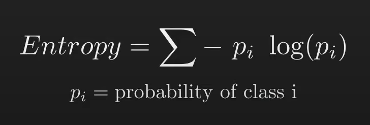

Decision Tree Classification
https://www.youtube.com/watch?v=ZVR2Way4nwQ

- Cho 1 tập các điển dũ liệu mẫu để phân tích 
  

- Decision node:  chứa điều kiện để chia dữ liệu ra thành nhiều loại
- Leaf node:  chứa loại đã được phân của dữ liệu

- Có rất nhiều cách chia khác nhau nhưng cách tối ưu nhất là chia để tìm đc Leaf node càng sớm càng tốt như ví dụ dưới

- Để đạt được điều này cần tính toán Information Gain, để tính Information Gain cần tính được Entropy

- Pi là tỉ lệ của class i 

- bên trên là ví dụ với root 
- áp dụng vào các nhánh còn lại ta được:  

- Để tính Information Gain dùng công thức

- Dễ thấy IG1 > IG2 nên sẽ chọn IG2, sau đó cứ tiếp tục cho đến khi ko còn lại Decision node nào.
